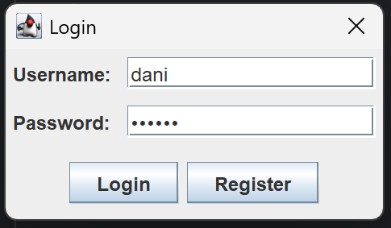
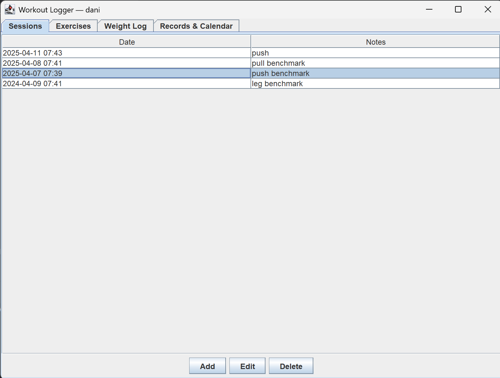
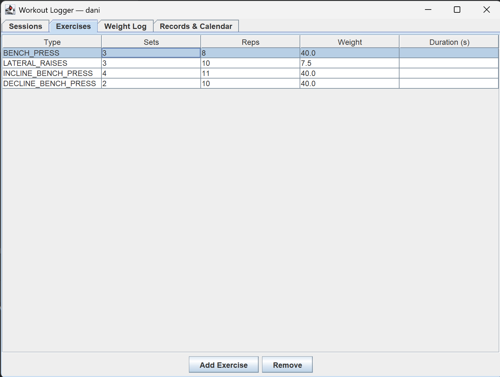
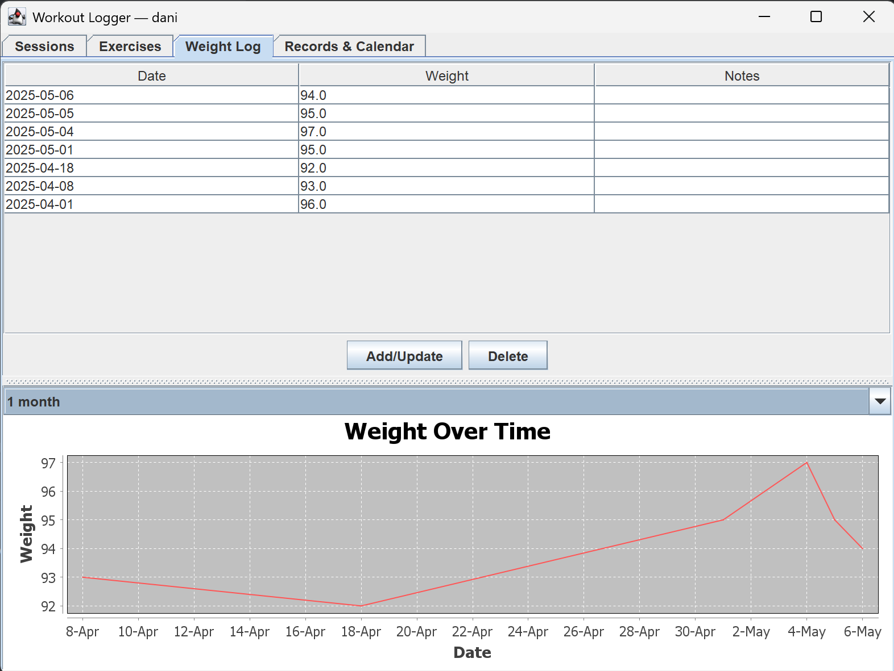
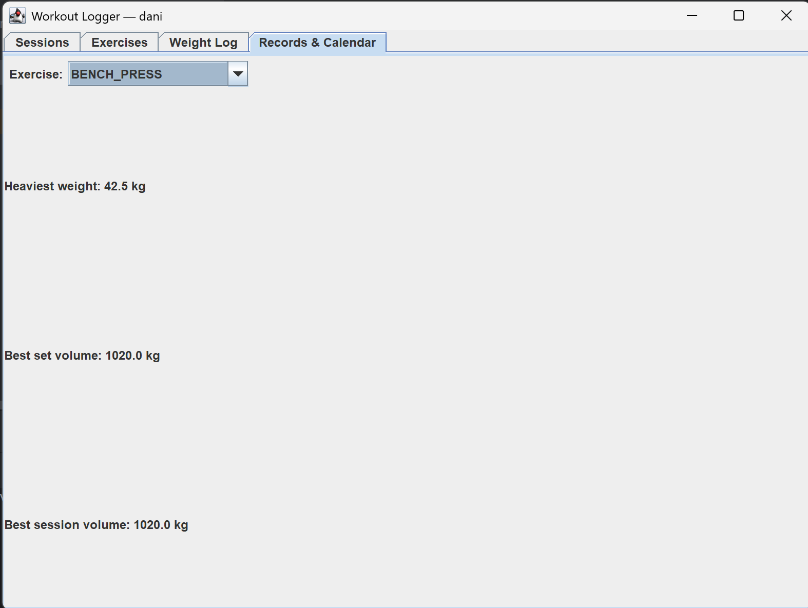

# workout-logger
App allowing users to track their gym progress.

- allows users to add multiple sessions

- customize the content of each section (exercises, sets, reps)

- users can also track their weight and see the evolution across various periods of time

- users can see records for each individual exercise
